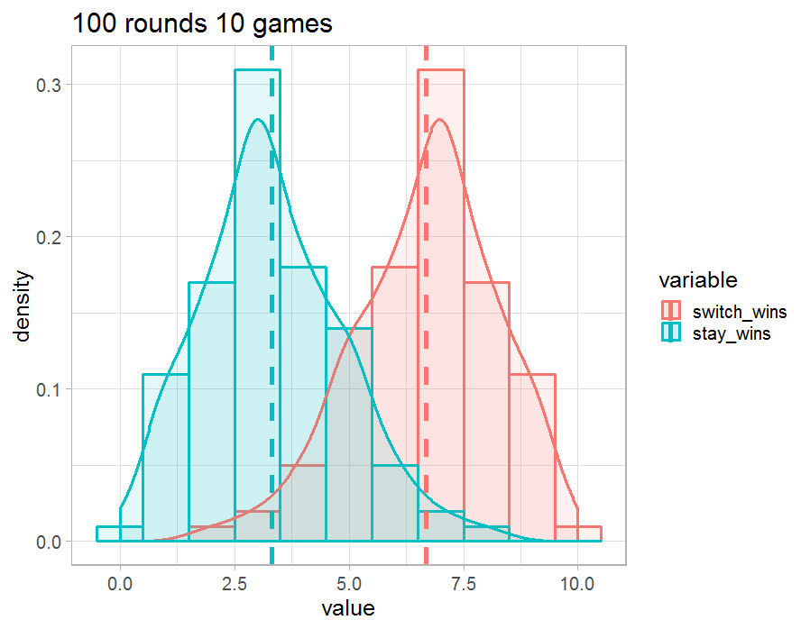
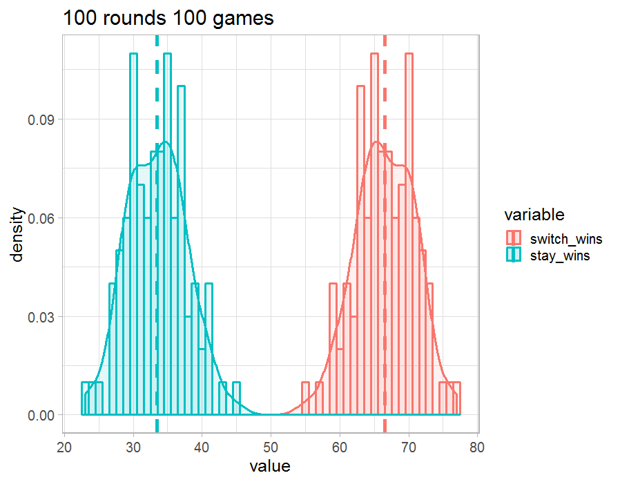

# Monty Hall problem simulation in R

Suppose you're on a game show, and you're given the choice of three doors: Behind one door is a car; behind the others, goats. 
You pick a door, say No. 1, and the host, who knows what's behind the doors, opens another door, say No. 3, which has a goat. 
He then says to you, "Do you want to pick door No. 2?" Is it to your advantage to switch your choice?

* https://en.wikipedia.org/wiki/Monty_Hall_problem
* https://en.wikipedia.org/wiki/Central_limit_theorem

### Table of Contents
1. [Data Summary](#data-summary)
2. [Plots](#plots)

# Data Summary
| n_rounds| n_games|variable    | mean_win|   sd_win|
|--------:|-------:|:-----------|--------:|--------:|
|       10|      10|switch_wins |     6.30| 1.059350|
|       10|      10|stay_wins   |     3.70| 1.059350|
|       10|     100|switch_wins |    67.60| 4.671426|
|       10|     100|stay_wins   |    32.40| 4.671426|
|      100|      10|switch_wins |     6.68| 1.543183|
|      100|      10|stay_wins   |     3.32| 1.543183|
|      100|     100|switch_wins |    66.58| 4.273905|
|      100|     100|stay_wins   |    33.42| 4.273905|

# Plots

